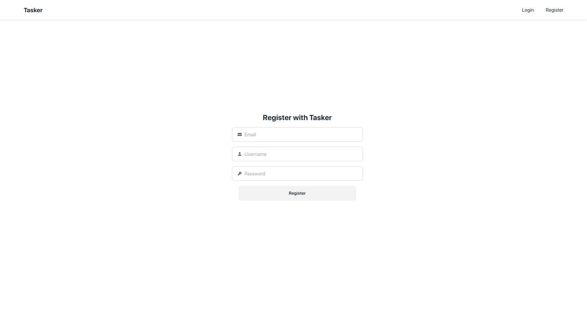
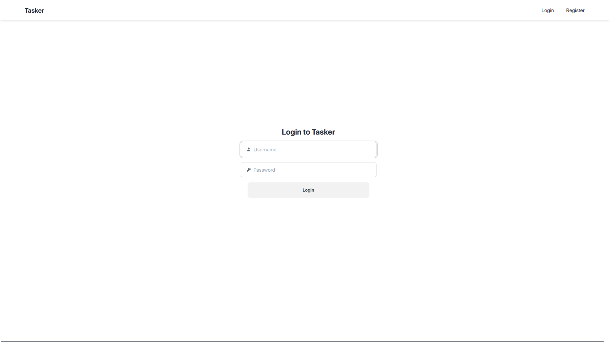
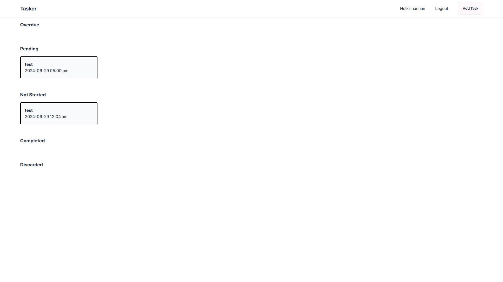
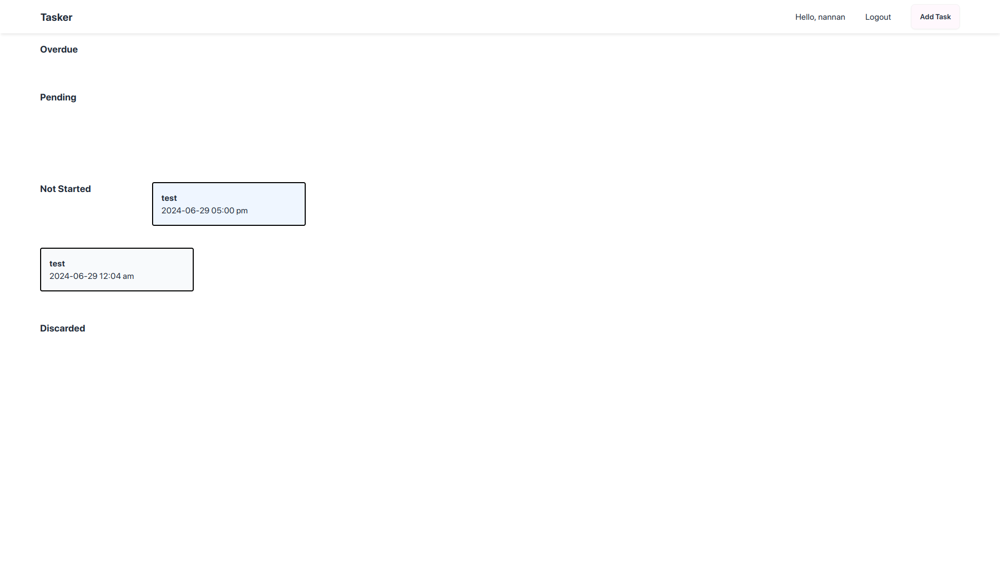
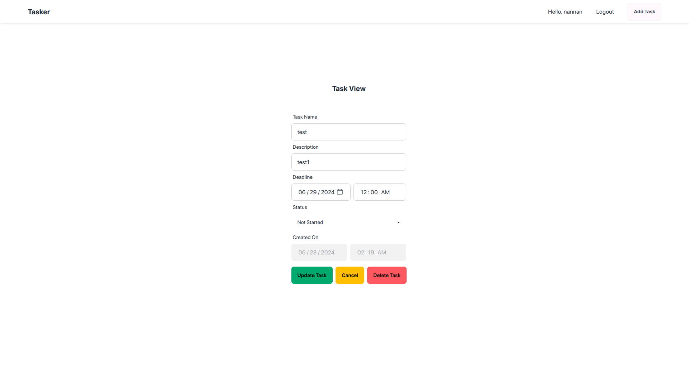
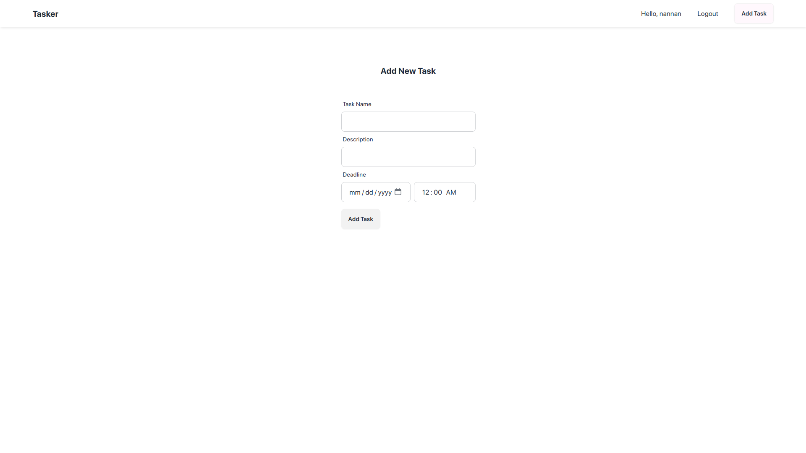

# Tasker - Frontend

### React.js | Tailwind | daisyui

#### Running the application

1. Install dependencies: `npm install`
2. Build the application: `npm run build`
3. Start the application: `npm start`

### Running the application in development mode

1. Install dependencies: `npm install`
2. Start the application: `npm run dev`

### Features

- [x] Drag Task to change status
- [x] Toast Notifications on actions

### Screenshots

